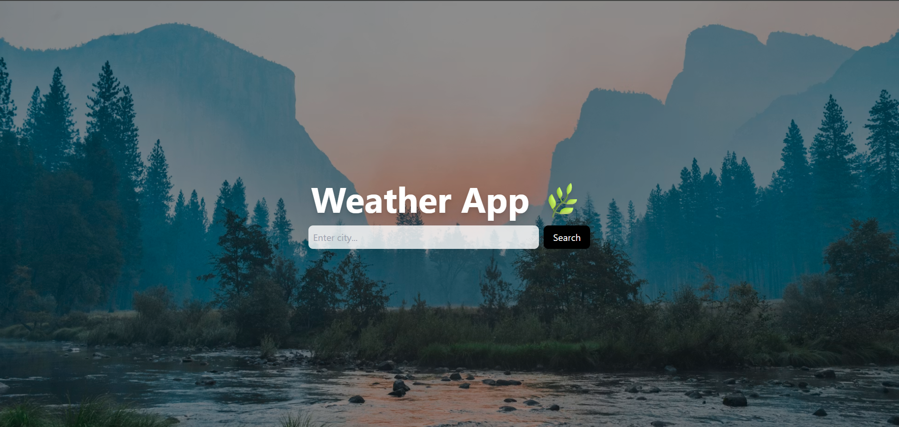
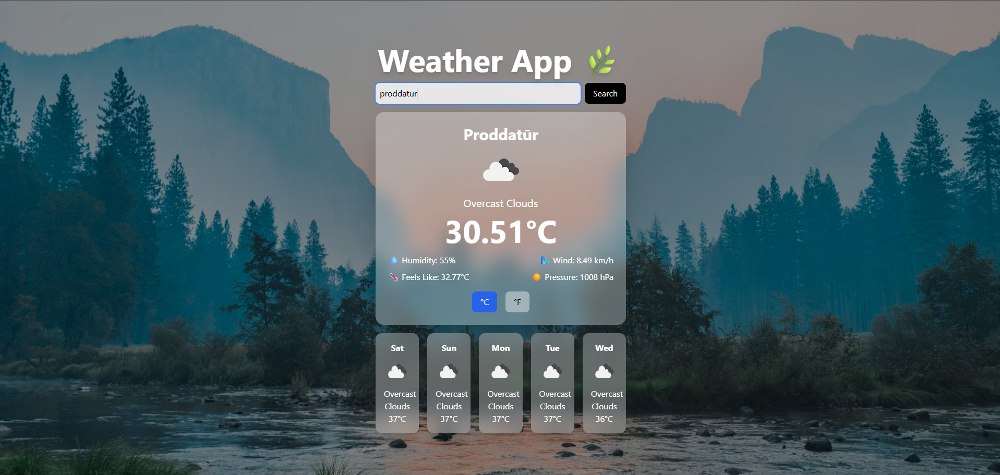
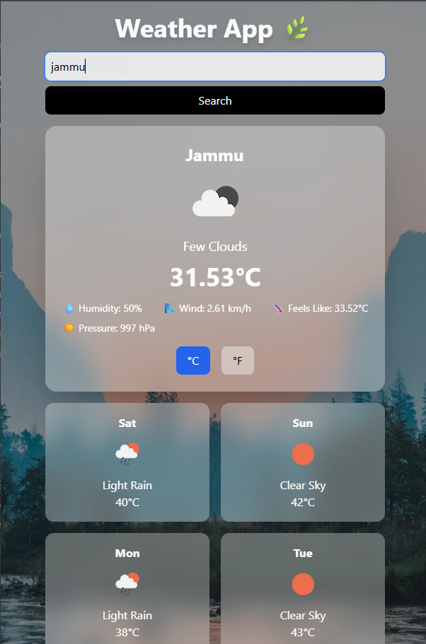

Live Streaming at: https://weather-app-hkcb.vercel.app/

# 🌤️ Weather App

A modern and responsive Weather Application built using React and Tailwind CSS that provides real-time weather updates and forecasts for any city worldwide.

---

# 📸 Screenshots

## 🏠 Home Screen

Displays the current weather information including temperature, weather condition, humidity, wind speed, and location.

---

## 🔍 Search Weather

Search for weather information by entering any city name.

---

## 📱 Mobile Responsive

Fully responsive design optimized for smartphones, tablets, and desktop devices.

---

## 🚀 Features

- 🔍 Search weather by city name
- 🌡️ Real-time temperature display
- 🌥️ Weather conditions (Cloudy, Sunny, Rainy, etc.)
- 📅 5-day weather forecast
- ⚡ Fast and responsive UI
- ❌ Error handling for invalid cities
- ⏳ Loading state for better UX

---

## 🛠️ Tech Stack

- **Frontend:** React.js (Vite)
- **Styling:** Tailwind CSS
- **Language:** JavaScript (ES6+)
- **API:** OpenWeatherMap API
- **State Management:** React Hooks (useState, useEffect)

---
